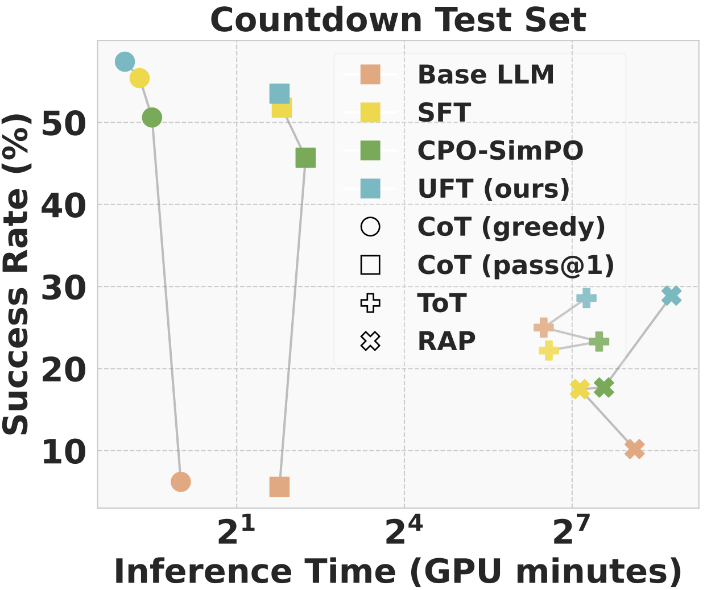

# Code for Offline *Learning* and *Forgetting* for Reasoning with Large Language Models

By [Tianwei Ni](https://twni2016.github.io/), [Allen Nie](https://anie.me/about), [Sapana Chaudhary](https://sapanachaudhary.github.io/), [Yao Liu](http://yao-liu.com/), [Huzefa Rangwala](https://cs.gmu.edu/~rangwala/), [Rasool Fakoor](https://sites.google.com/site/rfakoor) at Amazon Web Services.

See the paper at https://arxiv.org/abs/2504.11364 for details. 

## Overview

Recent approaches use *inference-time search* to help LLMs solve complex reasoning problems. While effective, these methods are often slow and computationally expensive.

To enable fast and high-performing inference while preserving search capability, we propose a fine-tuning approach with three components:
1. **Augmented fine-tuning data from diverse reasoners**: we preprocess reasoning paths from various algorithms into a unified *CoT-style* format for efficient reasoning at inference time. These reasoners include: 
   - [LLM-based](https://arxiv.org/abs/2404.05221): [Chain-of-Thought (CoT)](https://arxiv.org/abs/2201.11903), [Tree-of-Thought (ToT)](https://arxiv.org/abs/2305.10601), [Reasoning-via-Planning (RAP)](https://arxiv.org/abs/2305.14992)
   - Classic algorithms: [Breadth-First Search (BFS)](https://en.wikipedia.org/wiki/Breadth-first_search), [Depth-First Search (DFS)](https://en.wikipedia.org/wiki/Depth-first_search).

2. **Offline (unpaired) learning and forgetting objective**: we introduce *unlikelihood fine-tuning (UFT)* that teaches LLMs to follow successful reasoning paths and forget failed reasoning paths in the augmented dataset. This unpaired (non-preference-based) setup makes use of all available paths and improves upon standard supervised fine-tuning (SFT).

3. **Retaining search capability with a smaller learning rate**: perhaps surprisingly, we find that despite being fine-tuned on CoT-style paths, a much smaller learning rate enables the LLM to retain search performance at inference time.

<p align="center">

</p>

We evaluate our approach on [Game-of-24](https://en.wikipedia.org/wiki/24_(puzzle)) and [Countdown](https://en.wikipedia.org/wiki/Countdown_(game_show)#Numbers_Round), two mathematical reasoning benchmarks. Results show that our approach 
- outperforms *inference-time search baselines* (ToT, RAP) and *fine-tuning baselines* (SFT, preference optimization ([SimPO](https://arxiv.org/abs/2405.14734), [CPO-SimPO](https://github.com/fe1ixxu/CPO_SIMPO))) 
- significantly reduces inference time by 180× compared to inference-time search.

We use [Qwen2.5-Math-7B](https://huggingface.co/Qwen/Qwen2.5-Math-7B) and [Qwen2.5-Math-1.5B](https://huggingface.co/Qwen/Qwen2.5-Math-1.5B) as base models, running inference on 1 A100 GPU and fine-tuning on 8 A100s.

<p align="center">

</p>

### Example for the Countdown game

Each input consists of the game instruction and a set of numbers:
```
Use numbers and basic arithmetic operations (+ - * /) to obtain the target number. 
Each step, you are only allowed to choose two of the remaining numbers to obtain a new number.

Input: 25 5 5 33 
Target: 27
Steps: 
```
A correct output (multiple valid solutions may exist, evaluated by a rule-based verifier): 
```
25 + 5 = 30 (left: 5 33 30)
30 / 5 = 6 (left: 33 6)
33 - 6 = 27 (left: 27)
Answer: 33 - ((25 + 5) / 5) = 27
```
An incorrect output (incorrect paths are far more common than correct ones):
```
25 / 5 = 5 (left: 5 33 5)
33 - 5 = 28 (left: 28 5)
28 - 5 = 23 (left: 23)
Answer: 33 - ((25 / 5) + 5) = 23
```

## Getting Started

Installation:
```bash
conda create -n handbook python=3.10 && conda activate handbook
cd alignment/ && pip install -e .
python -m pip install flash-attn --no-build-isolation
pip install -r requirements.txt # may overwrite alignment's dependencies
# login if necessary
huggingface-cli login
wandb login
```

### 1. Datasets 🔢

We provide all training datasets in the [google drive](https://drive.google.com/file/d/1cu2xTI89uvK57LkrVeaYmiI4jDNRDZD_/view?usp=sharing) (370 MB) used in our experiments. 

The dataset is organized using the following path format:
```
data/<task>/corpora/<reasoner>/{correct, failed}_train.csv
```
- `<task>`: either `game24` or `countdown`
-  `<reasoner>`: for LLM reasoners, it is `<base_llm>/<reason_algo>`; for classic algorithms it is `{bfs, dfs}`
- `<reason_algo>`: `{cot, bfs, mcts}_<index>` corresponds to:
    - `cot`: [Chain-of-Thought (CoT)](https://arxiv.org/abs/2201.11903)
    - `bfs`: [Tree-of-Thought (ToT)](https://arxiv.org/abs/2305.10601)
    - `mcts`: [Reasoning-via-Planning (RAP)](https://arxiv.org/abs/2305.14992)
    - `index` suffix: a specific variant, determined by factors such as temperature, top_p, beam_size, exploration_parameter.
- `{correct, failed}`: correct or failed reasoning paths

Each csv file follows the format: 
- `case_id`: unique id including input numbers and target number (e.g., 24 in game-of-24)
- `success`: a boolean indicating whether the path solves the task or not
- `structured`: whether the path contains answer or not
- `text`: the full path (input, target, intermediate steps, answer). There might be multiple paths for one case. 

> [!NOTE]
> To re-generate the datasets using [our accelerated codebase](https://github.com/twni2016/llm-reasoning-uft/tree/main/reasoners) (which batches inputs via vLLM for a 100–1000× speedup ⚡). First, generate the raw LLM reasoning paths:
> ```bash
> bash scripts/countdown/data_gen.sh # CoT
> bash scripts/countdown/classic_gen.sh # classic BFS, DFS
> bash scripts/game24/data_gen.sh # CoT, ToT (BFS), RAP (MCTS)
> ```
> Then, preprocess these paths into training dataset in `data/*/corpora/` (as provided in the above link)
> ```bash
> bash scripts/countdown/data_pre.sh
> bash scripts/game24/data_pre.sh
> ```

### 2. Fine-tuning and evaluation 🧠

Fine-tune the LLM and evaluate checkpoints, all *within a single script*:
```bash
# SFT or UFT
bash scripts/countdown/train_eval.sh
bash scripts/game24/train_eval.sh
# SimPO or CPO-SimPO
bash scripts/countdown/train_eval_pref.sh
bash scripts/game24/train_eval_pref.sh
```
Some critical hyperparameters:
- `model_name`: [Qwen2.5-Math-7B](https://huggingface.co/Qwen/Qwen2.5-Math-7B) or [Qwen2.5-Math-1.5B](https://huggingface.co/Qwen/Qwen2.5-Math-1.5B)
- `dataset`: specifies the source of correct and failed reasoning paths. E.g., `cot_tot_rap.yaml` means a dataset mixed with paths from CoT, ToT, and RAP.
- `lr`: the peak learning rate. Our work shows that a small `lr` helps preserve the search capability during fine-tuning on CoT-style paths.
- `ul_alpha`: coefficient for the unlikelihood (UL) term, with `0.0` being SFT, a positive value being UFT.
- `cpo_alpha`: coefficient for the SFT term in preference optimization, with `0.0` being [SimPO](https://arxiv.org/abs/2405.14734), `1.0` being [CPO-SimPO](https://github.com/fe1ixxu/CPO_SIMPO) (recommended in our tasks). 

The logging and results for one run are in `data/<task>/train_logs/<base_model>/<dataset>/<setting>/<datetime>/`. Inside this folder, `checkpoint-<num>/` stores the model checkpoint at optim step `num`. 

After training completes, the script automatically evaluates all checkpoints for model selection.
If multiple runs are in progress, evaluation is deferred until all training runs finish, allowing parallel evaluation and saving time.
- `ft_inference.py` performs various reasoners including CoT (greedy decoding or sampling), ToT, and RAP. The results are stored in `assessment/` of each run. Models trained on Countdown data are also evaluated on Game-of-24.
- `process/ft_single_analysis.py` extract and summarize results from all checkpoints into `assessment/result.csv` and `result.pdf`. 
  
Finally, once all evaluations are complete, you can aggregate the results into a single CSV file using:
```bash
bash scripts/countdown/agg.sh
bash scripts/game24/agg.sh
```

## Acknowledgement
This codebase is inspired by and/or incorporates code from the following work:
- https://github.com/maitrix-org/llm-reasoners 
- https://github.com/kanishkg/stream-of-search
- https://github.com/huggingface/alignment-handbook
- https://github.com/yaojin17/Unlearning_LLM
- https://huggingface.co/docs/trl/en/cpo_trainer

## Citation
```bibtex
@article{ni2025teaching,
  title={Offline Learning and Forgetting for Reasoning with Large Language Models},
  author={Ni, Tianwei and Nie, Allen and Chaudhary, Sapana and Liu, Yao and Rangwala, Huzefa and Fakoor, Rasool},
  journal={arXiv preprint arXiv:2504.11364},
  year={2025}
}
```

## Contact
Please contact Tianwei (twni2016@gmail.com) or raise an issue if you have any question on the code.
